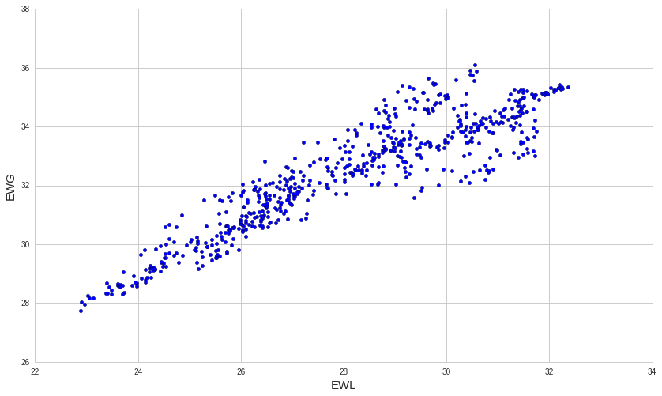
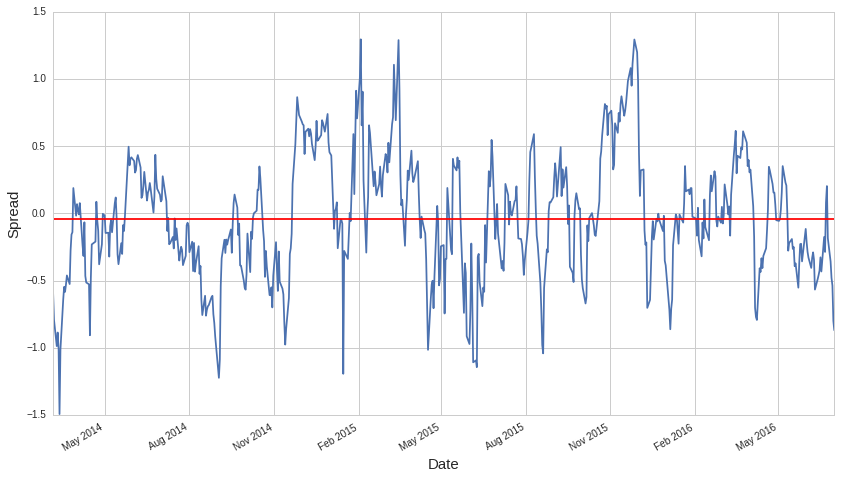
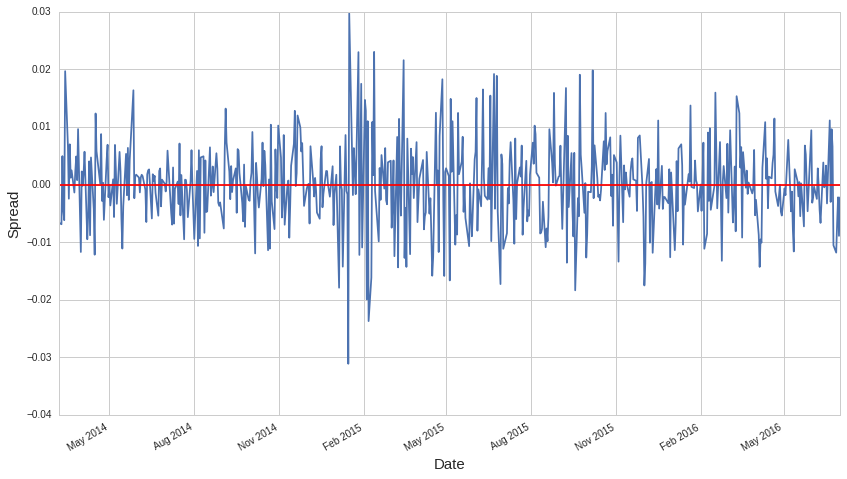
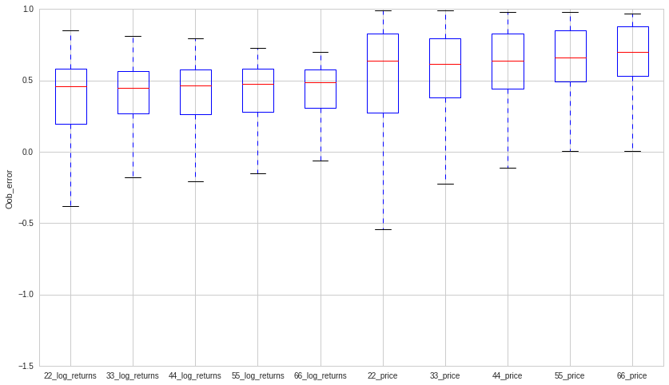
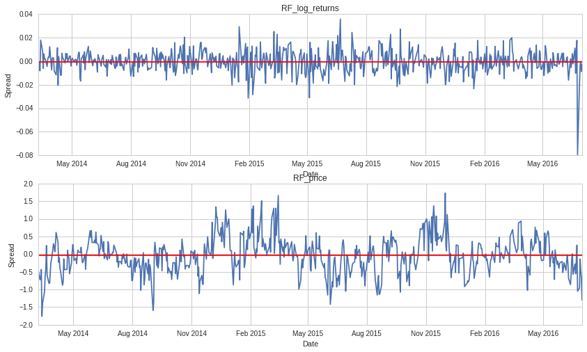
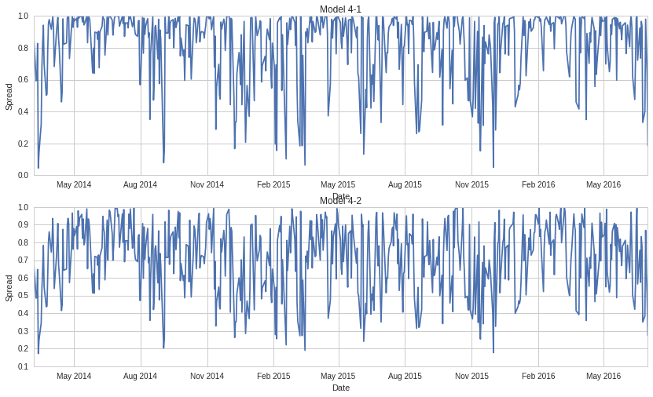

<h2 align="center">Nonparametric Pairs Trading</h2> 
<h3 align="center">Jan Tomoya Greve</h3> 

<h3 align="center">Abstract</h3> 

•I've modified conventional pairs trading algorithm shown in the book "Chan, Ernie. Algorithmic trading: winning strategies and their rationale. John Wiley & Sons, 2013." by combining several nonparametric (and machine learning) methods.

• The conventional algorithm uses residuals obtained from linear regression of log returns of one to the other instrument as spreads. Subsequently, divergence of current spread value from it's long term mean (=0) is calculated by Bollinger Bands.

• In my final algorithm, residuals obtained from Random Forest regression of price of one to the another is used as spreads instead. Spreads are then converted with non-linear transfomation to make it easier to detect divergece. Stiatonary bootstrapped mean confidence interval is used as a divergence ditector instead of Bolinger Bands. This modification enhanced the robustness of pairs trading considerably.

• Backtest is used as a way of comparing performances of different algorithms that I've built. In my thesis Hansen's SPA test is also conducted.

**I. What is Pairs trading?**

Pairs trading is a market neutral strategy which takes advantage of a situation when the equilibrium of higly correlated financial instruments (for example stocks of Visa and Mastercard) diverges temporary, but is expected to revert again to similar balance. When this presumption about that particular pair of instrumens holds true, it's possible to make a profit by going long on the under-performing one and short on the other when diversion happens, and subsequently close these positions when it reverts back to normal. The figure below is a typical illustration of this process.

<h3 align="center">Fig.1: An example of pairs trading (from http://tsuzuki.ise.ibaraki.ac.jp/TS_lab/slide/IFTA.046.jpg)</h3> 

  

Benefits of the pairs trading

1. Market neutrality: Regardless of overall market movement, pairs trading can make a profit. Even in bear market, if there is sufficiently large price discrepancy between a pair of similar instruments, a profit can be realized.

2. Short holding period: In pairs trading, holding of instruments takes place only when prices of the pair diverge temporaly. On other occasions it does nothing, thus immune to any risks (but also not making any profits).

Risks and Disadvantages of the pairs trading

1. Requires two commissions to enter and exis each trade: Because it's always traded in a pair, commissions are also paid twice which might reduce the profit significantly because gains of pairs trading tend to be small on each transaction.

2. Execution risk: Pairs trading expects instant execution with little or no slippage and  small bid-ask spreads. If these conditions are not met, profit may be squeezed.

3. Model risk: As long as divergence is temporal and a certain equilibrium between a pair exits, there are chances to make a profit. However, when that relationship breaks down, this strategy will stop functioning.

**II. Procedure of pairs trading.**

step1: Find a pair of instruments that are linked

No concrete procedure exists in finding possible candidates  to trade in this strategy. However, there are several useful measurements and concepts which define an ideal pair of stocks.

1. Correlation: Highly correlated instruments are expected to possess similar qualities thus being perfect candidates of pairs trading. Nevertheless, if the correlation is too high (for example SPY and ITOT have correlation coefficient of about 0.99) even when they diverge, the spread is so small that it's unlikely to make any significant profit.

2. Mean reversion: Mean reversion is a phenomenon where a random process following an extreme event tends to be less extreme later in comparison. In the pairs trading, spreads are expected to be mean reverting.

3. Stationarity: Stationarity means that regardless of time and positions of a series, probability density, mean and variance is constant. In any time series analysis, dealing with non-stationary series are troublesome, thus expect spread series to be stationary as possible.

step2: Design spread series

How can we design an optimal mean-reverting stationary spread series from two correlated stocks? Common way of doing this is by linear regression. When there are no serial correlation as well as irregularities such as outliers, residuals from linear regression is expected to be centered around the mean while keeping constant variance. Threfore, residuals are stationary and mean reverting by nature as long as these conditions hold. 

Nevertheless, the degree of stationarity may still be somewhat different between a residual series made from regressing y against x and other way around. This is because former case is looking for approximation of y as a function of x while latter is opposite which is not symmetrical. Therefore, we must check which way of combining a pair would produce better(=more mean-reverting and stationary) residuals.

step3: Detect divergence and convergence

After desinging optimal spreads with linear regression, we must find a way of detecting when it diverged significantly enough from mean(in this case a value of about zero is expected to become a mean) and when its reverting back again.

III. An example of conventional algorithm following former procedure (using data from 2014/01/01 to 2016/07/31)

**※All these steps should be done using the data before trading period(~2014/01/01), but here I will intentionally in-sample data on these steps except step3. Therefore, the choice of a pair and the way of combining it (which stock price series to be independent or dependent variable) will be ideal thus inflating the result.  This is to ensure that best possible results of conventional algorithm is used in comparison with mine. **

**※ A fixed comission fee of  $\$ 0.005$ per share is used which is simulating Interactive Broker.Inc's flat rate. Slippage is set to zero and initial capital is $\$100,000$ on all following backtest results.**

step1

Since it's unviable to make a correlation matrix of all available stocks and look for related pairs, I would simply choose pairs with my own insight. In this example, I'll choose EWG and EWL as a candidate.

    #get price data from 2014/01/01 to 2016/07/31
    EWG = get_pricing('EWG',fields='close_price',start_date='2014-01-01',
                    end_date='2016-07-01',frequency='daily')
    EWL = get_pricing('EWL',fields='close_price',start_date='2014-01-01',
                    end_date='2016-07-01',frequency='daily')
    #compute correlation
    EWG.corr(EWL)

    0.91305464778437517

<h3 align="center">Fig.2: Scatter plot of EWG and EWL </h3> 

    import matplotlib.pyplot as plt
    plt.scatter(EWG,EWL)
    plt.ylabel("EWG",fontsize=15)
    plt.xlabel("EWL", fontsize=15)

    <matplotlib.text.Text at 0x7fef517ea1d0>

step2

As mentioned before, stationarity and mean-reversion of residuals will be slightly different if we switch independent and dependent variable in linear regression. Therefore, we must find which way of regressing produces better residual series(=spread series).

I.　Economic explanation

EWG is tracing German stock index  while EWL is tracing its Swiss counterpart. Price movements on stock index of a nation can be considered as a proxy to its economic condition. Whilst German economy might influence Swiss economy, the other way around seems unlikelly. Threfore, it would be more intuitive to make EWG as an independent variable.

II. Statistical concern over explanation I

Although the logic behind I. is understandable, because of the statistical limitation of simple linear regression, the suggestion in I. is invalid. Ultimately, using a simple linear regression to explain the economic condition of a country is void and its regression coefficcient will be severly distorted by confounders. Therefore, there are no guarantee that residuals are more stationary if EWG is independent, because regression coefficient will not represent a pure causial relationship between German and Swiss economy but rather be more of a hodgepodge of many different noises.

III. Using stationarity tests to determine the way of combining

Following the argument in II, we cannot determine which way of regressing will produce better residuals by simply considering its likely causial relationship. Therefore, we use stationarity tests on residuals produced by regression of y on x and x on y and compare p-values between them. 

    from statsmodels.tsa.stattools import coint
    #Dependent : EWG Independent: EWL
    a=coint(EWG,EWL,regression='c')[1]
    #Dependent : EWL Independent: EWG
    b=coint(EWL,EWG,regression='c')[1]
    print([a,b])

    [0.024775858338677046, 0.021611652128140216]

Unfortunately, p-values are almost identical. There are little reason to prefer one from another given this result. 

There are however, another empirical practice mentioned in Vidyamurthy G. (2004) which choses an instrument with less volatility as an independent variable.

    import numpy as np
    a = np.var(EWG)
    b = np.var(EWL)
    #a : volatility of EWG, b: volatility of EWL
    print([a,b])

    [5.617576069279139, 3.5991657494648495]

From this result we choose EWL as an indepented variable. Even without conducting this test, it's natural to assume that stock index of Switzerland is more stable than that of Germany in most occasions given it's stable economy.

Now that we have determined the way of producing spread series, we have to consider how much data to use in order to compute a spread in each trading days. Since we are using daily data, this problem is the  same as deciding how many days of data to look back, and for this reason the window of regression is called **look-back period**. A criterion commonly used to determine look-back period is half-life of mean-reversion and it can be approximated as follows in this example.

    import numpy as np
    import statsmodels.api as sm
    #generate residuals
    model = sm.OLS(EWG,sm.add_constant(EWL))
    model_fit = model.fit()
    resid =EWG-model_fit.predict(sm.add_constant(EWL))
    #regress the difference in residuals against the last residual 
    md = sm.OLS(resid.diff(), sm.add_constant(resid.shift()), missing='drop')  
    mdf = md.fit()
    #lambda : regression coeficcients of the last residual
    lambda_ = mdf.params[1]
    #compute log(2)/lambda
    half_life = -np.log(2)/lambda_
    print(half_life)

    21.3275011894

From this, we have derived that half-life of mean-reversion is about 22 days. In practice, setting look-back period to small multiples of half-life is considered optimal and we will use look-back of 44 days in the following example.

<h3 align="center">Fig.3: Flactuation of spread series(look-back of 44days)</h3> 

    import pandas as pd
    model44 = pd.ols(y=EWG,x=EWL,window_type='rolling',window=44)
    model44.resid.plot()
    plt.axhline(model44.resid.mean(),color='red')
    plt.ylabel("Spread",fontsize=15)
    plt.xlabel("Date", fontsize=15)

    <matplotlib.text.Text at 0x7fef3ec9d550>

From above figure, we can clearly see that spread series have mean of about zero (the red line), and flactuating up to around plus-minus $\$$1.5 per stock pairs and they cleary possess stationarity and mean-reversion in certain extent.

If a current spread goes down significantly, it means that $EWG-\beta EWL$ is minus and thus EWG is temporary under-performing compared to EWL. Therefore, the algorithm will go long on EWG and short on EWL by the ratio of $1:\beta$. 

Although the figure above represents the amount of profit capturable for one unit of a pair, spreads obtained from regressing price series are not directly used to get trading signals. Insted, regression of log returns are conducted to generate more capturable spread series. This is how spreds generated in this manner look like.

<h3 align="center">Fig.4: Flactuation of log returns spread series(look-back of 44days)</h3> 

    Y = np.log(EWG/EWG.shift(1))
    X = np.log(EWL/EWL.shift(1))
    X = X.dropna()
    Y = Y.dropna()
    model = pd.ols(y=Y,x=X,window_type='rolling',window=44)
    model.resid.plot()
    plt.axhline(model.resid.mean(),color='red')
    plt.ylabel("Spread",fontsize=15)
    plt.xlabel("Date", fontsize=15)

    <matplotlib.text.Text at 0x7fef3ec287d0>

step3

Bollinger band is a common volatility indicator which can be used to detect a divergence in spread series. Here, we are going to use threshold z-values of plus-minus 0.75 to open positions and 0 to close them in backtest.

We call these conventional procedure as Model 1 to compare with other models that show up later.

<h3 align="center">Fig.5:Backtest result of Model 1 (look-back: 44 days, thresholds = $\pm$ 0.75)</h3> 

The backtest result is total returns of 12.6%, sharpe ratio of 1.30 (above 1.0 is considered excellent result),$\beta$(Market sensitivity, in pairs trading it should be around zero) of 0.01. Compared to red bencmark of just holding EWG during the whole trading period, pairs trading are quite successful both in terms of profitability and stability. 

Nevertheless, it is highly unlikely to keep operating an algorithm that continues to lose money for about a year until it finally starts to make money.

Moreover, we must not forget that we have intentionally used in-sample data to compute nearly optimal half-life of mean reversion and there are no theoritical justification to use thresholds of $\pm 0.75$ as well.  In practice, half-life must be estimated using only the past price data which might produce entirely different value.

Therefore, we should take a look at how results will differ if these parameters are changed slightly to simulate best possible situation that half-life calculated by past data only differs slightly.

<h5 align="center">Table.1:Backtest results with different look-back period and thresholds</h5> 

| Look-back | Threshold value |Model 1|Look-back | Threshold value |Model1|
|------------------|--------------|--------------|
| 33            | 0.75 |  11.1% 1.00 0.00|55  | 0.75 |  6.8% 0.63 0.02|
| 33            | 1.00 |  5.5% 0.56 0.01|55            | 1.00 |  13.8% 1.40 0.01|
|33            | 1.50 |  1.8%  0.27 0.01|55            | 1.50 |  8.1% 1.06 0.01|
| 44            | 0.75 |  12.6% 1.30 0.02|66            | 0.75 |  6.0% 0.54 0.01|
| 44            | 1.00 |  11.4% 0.99 0.01| 66            | 1.00 |  10.8% 1.06 0.00|
|44            | 1.50 |  7.0%  0.93 0.00|66            | 1.50 |  4.6% 0.64 0.01|

We can clearly see the problem of the conventional algorithm. Even a slight change in look-back or thresholds have significant effect on overall performance.

After all, this  method is so well-known among traders that it even appears in textbook of algorithmic trading. Hence, competition for a profit must be severe.

IV. Problems of the conventional method (apart from being widely known)

・ Look-back sensitivity

When look-back period is short, it would adjust better to a new observation because composition of data would be shuffled faster, but the degree of freedom is low and thus resulting spread series could be unstable.

On the other hand, when look-back is long,  new observation has little weight because linear regression is a global optimizer which will assign similar weights to all data points (when there are no outliers) regardless of it's value in prediction. Thus, old data points with little implications to current value is still influential in predicion. 

・ Sensitivity to thresholds

Because spread series are never perfectly stationary, z-values of spreads are also calculated using the data within the look-back period. Therefore, spreads cannot be considered IID, as it does with this method.

V.　Ideas to improve the algorithm
1. Modification to step 2 

・If we use more flexible regression to generate spread series, the dilemma of look-back period length may be ameliorated

Ordinary linear regression is problematic because of it's parametric constraints which will only allow global optimization. If predictions of each data points are weighted locally, look-back sensitivity might deminish because old observations are expected to be distant from newer ones.

There are many locally weighted regressions such as Splines, GAM and so on. However, most of them must be tuned in order to settle bias-variance trade-offs and determine the sape of predictions. Any faliure to do so during the trading period will be detrimental to the robustness of the algorithm.

Random forest regression is a perfect candidate in this task because it's non-parametric, robust (if the number of trees are sufficiently large) and locally weighted.

・When we perform Random forest regression instead of OLS, is log returns transformation still necessary?

Log returns tranformation was done partily to ameliorate look-back sensitivity issues because unlike prices, log returns can be considered normally distributed and is therefore less prone to inclusion of old data.

However, this transformation will remove some information. Therefore, we must weight wheter the extra assurance of solving look-back sensitivity is worth the cost of losing some information about the relationship between the pair.

To gain a perspective of how much we lose information, we first calculate the correlation between log returns of EWG and EWL and compare it with original correlation.

    print("Correlation before transformation  {}".format(np.corrcoef(EWG,EWL)[0,1]))
    print("Correlation after transformation  {}".format(np.corrcoef(X,Y)[0,1]))

    Correlation before transformation  0.913054647784
    Correlation after transformation  0.807717256269

Correlation dropped from about 0.91 to 0.81 which might be significant.

To gain even more perspective, we calculate out of bag errors obtained from rolling Random forest regression of the training data.

The figure below are the box plots of these values with different look-backs.

    from sklearn.ensemble import RandomForestRegressor
    window =[22,33,44,55,66]
    errs = []
    for hoge,win in enumerate(window):
        idx = 0
        oob_error =[]
        while idx<(len(EWL)-win):
            rf = RandomForestRegressor(n_estimators=100,oob_score=True)
            rf.fit(EWL[idx:idx+win,None],EWG[idx:idx+win])
            oob_error.append(rf.oob_score_)
            idx = idx+1
        errs.append(oob_error)
    errs_ = []
    for hoge,win in enumerate(window):
        idx = 0
        oob_error_ =[]
        while idx<(len(X)-win):
            rf = RandomForestRegressor(n_estimators=100,oob_score=True)
            rf.fit(X[idx:idx+win,None],Y[idx:idx+win])
            oob_error_.append(rf.oob_score_)
            idx = idx+1
        errs_.append(oob_error_)
    data = [errs_[0],errs_[1],errs_[2],errs_[3],errs_[4],errs[0],errs[1],errs[2],errs[3],errs[4]]
    plt.figure()
    plt.boxplot(data)
    plt.xticks([1, 2, 3,4,5,6,7,8,9,10], ['22_log_returns',
                                               '33_log_returns','44_log_returns','55_log_returns','66_log_returns',
                                          '22_price', '33_price', '44_price','55_price','66_price'])
    plt.ylabel('Oob_error')
    plt.show()

It's clear that log returns trasformation had a significant downward effect on model confidence.

In this thesis, we are limiting the size of the pair to two instruments, if their relationship is weak, Random forest regression may break down more easily than linear regression due to its being more flexible algorithm.

To check this, figures below are spread time series. As we can see, that of log returns are clearly nonstationary at the end which was caused by Brexit referendum.

<h3 align="center">Fig.6,7:The flactuation of spread series generated by RF(upper: log returns, lower: prices, look-back=44)</h3> 

    result = []
    idx = 0
    window = 44
    oob =[]
    while idx<(len(X)-window):
        rf = RandomForestRegressor(n_estimators=100,oob_score=True)
        rf.fit(X[idx:idx+window,None],Y[idx:idx+window])
        result.append(rf.predict(X[idx+window]))
        oob.append(rf.oob_score_)
        idx = idx+1
    resid_rf=[]
    for idx,val in enumerate(result):
        resid_rf.append(float(Y[idx+window]-val))
    result_ = []
    idx = 0
    oob_ =[]
    while idx<(len(EWL)-window):
        rf = RandomForestRegressor(n_estimators=100,oob_score=True)
        rf.fit(EWL[idx:idx+window,None],EWG[idx:idx+window])
        result_.append(rf.predict(EWL[idx+window]))
        oob_.append(rf.oob_score_)
        idx = idx+1
    resid_rf_=[]
    for idx,val in enumerate(result_):
        resid_rf_.append(float(EWG[idx+window]-val))
    plt.subplot(211)
    plt.plot(X[window:].index,resid_rf)
    plt.axhline(np.mean(resid_rf),color='red')
    plt.title("RF_log_returns")
    plt.ylabel("Spread")
    plt.xlabel("Date")
    plt.subplot(212)
    plt.plot(EWG[window:].index,resid_rf_)
    plt.axhline(np.mean(resid_rf_),color='red')
    plt.ylabel("Spread")
    plt.xlabel("Date")
    plt.title("RF_price")

    <matplotlib.text.Text at 0x7fef36e0dc90>

Finally, we conduct bactests with different set of parameters with those two spreads.

The former model with log returns transformation is called model 2-1 and the latter model 2-2.

The table below shows the results. 

<h5 align="center">Table.2:Backtest results of Model 2-1 and Model 2-2 with different look-back period and thresholds</h5> 

| Look-back | Threshold value |Model 2-1| Model 2-2|
|------------------|--------------|--------------|--------------|--------------|
| 22            | 0.75 |4.2% 0.67 -0.02|17.6% 1.33 -0.02|
| 22            | 1.00 |3.8% 0.41 -0.01|18.5% 1.46 -0.02|
|22           | 1.50 |3.6% 0.56 -0.00|16.4% 1.57 -0.01|
| 33            | 0.75 |9.2% 0.89 -0.01|14.4% 1.06 -0.00|
| 33            | 1.00 |9.9% 1.06 -0.01|13.0% 1.03 -0.01|
|33            | 1.50 |6.0% 0.79 -0.00|11.3% 1.07 0.00|
| 44            | 0.75|5.5% 0.53 0.01|13.9% 1.10 0.03|
| 44            | 1.00 |4.3% 0.47 0.01|11.2% 0.95 0.02|
|44            | 1.50 |6.6% 0.88 0.00|13.1% 1.23 0.02|
| 55            | 0.75|7.0% 0.67 -0.01|8.9% 0.71 0.01|
| 55            | 1.00 |10.3% 1.08 0.00|10.6% 0.88 0.01|
| 55            | 1.50|11.0% 1.42 0.00|8.6% 0.82 0.01|
| 66            | 0.75|9.0% 0.92 -0.01|0.9% 0.10 0.01|
| 66            | 1.00 |10.4% 1.18 0.01|2.9% 0.26 0.01|
| 66            | 1.50 |7.52% 1.05 0.01|7.1% 0.67 0.01|

It's evident that which one is the clear winner.

We will also visually examine the difference in behavior in a parameter settings where resulting sharpe ratio was nearly identical.

<h3 align="center">Fig.8:Backtest result of Model 2-1 and Model 2-2 (look-back: 33, thresholds: 1.0)</h3> 

We can see that returns on model 2-1 is not fundamentally different from that of model 1 while model 2-2 has managed to generate returns from the early stages but has also higher drawdown.

For all these reasons, we will consider improving model 2-2 further and discard model 2-1 which uses unnessesary transformation .

 ２. Modification to step 3

We may be able to augument this algorithm further by transforming step3. Although Bollinger Bands are proven method to detect volatility in many times series data, it's also dependent on length of look-back period in order to calculate z-values. 

A more stable volatility detection may be done by simulation based methods because simulation results are less affected by inclusion or exclusion of few observations. Hence, I will use the confidence interval of stationary bootstrapped mean to detect divergence in spread series. 

Basically, it can be understood as a simulated version of moving average method: when current spread value is out of certain confidence interval of bootstrapped mean value, positions are opened, and when the spread reverted back to the center of probability distribution of bootstrapped mean value, positions are closed.

We name this algorithm with extra modification done to step 3 as Model 3. In this algorithm, thresholds are confidence intervals of bootstrapped mean distribution. We prepared three possible values; 90%, 95% and 99%. The table below are results alinged with that of previous model.

<h5 align="center">Table.3:Backtest results of Model 2-1,2-2 and 3 with different look-back period and thresholds</h5> 

| Look-back | z-value |Model 2-1| Model 2-2|CI |Model 3|
|------------------|--------------|--------------|--------------|--------------|
| 22            | 0.75 |4.2% 0.67 -0.02|17.6% 1.33 -0.02|90%|18.7% 1.35 -0.02|
| 22            | 1.00 |3.8% 0.41 -0.01|18.5% 1.46 -0.02|95%|16.4% 1.20 -0.02|
|22           | 1.50 |3.6% 0.56 -0.00|16.4% 1.57 -0.01|99%|17.1% 1.26 -0.02|
| 33            | 0.75 |9.2% 0.89 -0.01|14.4% 1.06 -0.00|90%|12.2% 0.92 -0.02|
| 33            | 1.00 |9.9% 1.06 -0.01|13.0% 1.03 -0.01|95%|13.6% 1.00 -0.03|
|33            | 1.50 |6.0% 0.79 -0.00|11.3% 1.07 0.00|99%|12.2% 0.94 -0.00|
| 44            | 0.75|5.5% 0.53 0.01|13.9% 1.10 0.03|90%|16.3% 1.18 0.01|
| 44            | 1.00 |4.3% 0.47 0.01|11.2% 0.95 0.02|95%|14.7% 1.08 -0.00|
|44            | 1.50 |6.6% 0.88 0.00|13.1% 1.23 0.02|99%|13.4% 1.00 -0.01|
| 55            | 0.75|7.0% 0.67 -0.01|8.9% 0.71 0.01|90%|8.69% 0.66 -0.00|
| 55            | 1.00 |10.3% 1.08 0.00|10.6% 0.88 0.01|95%|11.6% 0.89 -0.01|
| 55            | 1.50|11.0% 1.42 0.00|8.6% 0.82 0.01|99%|12.1% 0.93 -0.01|
| 66            | 0.75|9.0% 0.92 -0.01|0.9% 0.10 0.01|90%|4.5% 0.35 -0.00|
| 66            | 1.00 |10.4% 1.18 0.01|2.9% 0.26 0.01|95%|6.2% 0.47 -0.00|
| 66            | 1.50 |7.52% 1.05 0.01|7.1% 0.67 0.01|99%|7.8% 0.6 -0.01|

In almost all look-back periods, results of model 3 are inferior to that of  model 2-2.

To take a more detailed look at how trading was done, we will compare results of model 2-2 and 3 with look-back of 55 days and threshold value of 1.00 and 95% which have similar sharpe ratios.

<h3 align="center">Fig.9,10:Backtest results of Model 2-2 and Model 3 (look-back: 55, thresholds: 1.0,95%)</h3> 

Almost all measurements are identical.

A significant difference between those two algorithms that are not clearly visible from figures above is the number of transaction.

Model 2-2 has done 58 times while model 3 did 115 times. This means that model 3 payed more commision fees but at the same time holding time is also shorter which reduces the market exposure.

The primary reason why model 3 did not generate more returns than 2-2 is because follwing the increase of transaction, the number of transaction which led to loss also increased.

Typically, when transaction leds to a loss, it is because divergence was not as large as to exceed the comission fee. Threfore, if we can cut those unprofitable transactions, we might be able to achive significantly higher returns.

３. Modification to spread series

One way of cutting the number of unprofitable transactions are to make nonlinear transformation to spread series, so that only when the current spread diverges significantly from mean value of zero should it be detected by the bootstrap.

I came up with two possible transformations that are bounded in a certain range of values and at the same time has this property: if spreads are denoted as $x$ the former transformation is $ f(x) = \exp(-x^2)$ and the latter $f(x) = \exp (-|x|)$. We call the algorithm with fomer transformation as model 4-1 and the latter as model 4-2.

If we apply this transformation, when the the current spread is reasonably close to 0, $f(x)$ will be about 1, and when the value gets more distant from 0, $f(x)$ will exponentially decrease to 0. 

Therefore the bootstrap upper interval will be close to 1 while lower interval will be close to 0. Then we can open positions when transformed spread value crosses the lower interval and close positions when it go through upper one.

To illustrate how spread series are transformed figures below are spreads of model 4-1 and model 4-2.

<h3 align="center">Fig.11,12:Flactuation of squared spread series of model 4-1 and 4-2 (lookback = 33)</h3> 

    plt.subplot(211)
    plt.plot(EWG[window:].index,np.exp(-np.array(resid_rf_)**2))
    plt.ylabel("Spread")
    plt.xlabel("Date")
    plt.title("Model 4-1")
    plt.subplot(212)
    plt.plot(EWG[window:].index,np.exp(-np.abs(np.array(resid_rf_))))
    plt.ylabel("Spread")
    plt.xlabel("Date")
    plt.title("Model 4-2")

    <matplotlib.text.Text at 0x7fef368bd690>

Finally,the table below are results of model 4-1 and 4-2 alinged with that of previous models.

<h5 align="center">Table.4:Backtest results of Model 2-1,2-2,3, 4-1 and 4-2 with different look-back period and thresholds</h5> 

| Look-back | z-val |Model 2-1| Model 2-2|CI |Model 3|Model 4-1|Model 4-2|
|------------------|--------------|--------------|--------------|--------------|--------------|--------------|--------------|
| 22            | 0.75 |4.2% 0.67 -0.02|17.6% 1.33 -0.02|90%|18.7% 1.35 -0.02|10.3% 1.19 -0.00|22.5% 2.02 -0.00|
| 22            | 1.00 |3.8% 0.41 -0.01|18.5% 1.46 -0.02|95%|16.4% 1.20 -0.02|8.0% 0.95 -0.00|20.6% 1.87 0.00|
|22           | 1.50 |3.6% 0.56 -0.00|16.4% 1.57 -0.01|99%|17.1% 1.26 -0.02|9.3% 1.08 0.01|16.9% 1.66 0.01|
| 33            | 0.75 |9.2% 0.89 -0.01|14.4% 1.06 -0.00|90%|12.2% 0.92 -0.02|14.0% 1.60 0.00|13.2% 1.38 0.00|
| 33            | 1.00 |9.9% 1.06 -0.01|13.0% 1.03 -0.01|95%|13.6% 1.00 -0.03|12.5% 1.46 0.00|15.9% 1.65 0.01|
|33            | 1.50 |6.0% 0.79 -0.00|11.3% 1.07 0.00|99%|12.2% 0.94 -0.00|13.1% 1.55 0.00|15.6% 1.65 0.01|
| 44            | 0.75|5.5% 0.53 0.01|13.9% 1.10 0.03|90%|16.3% 1.18 0.01|17.2% 1.98 0.02|14.0% 1.41 0.03|
| 44            | 1.00 |4.3% 0.47 0.01|11.2% 0.95 0.02|95%|14.7% 1.08 -0.00|16.3% 1.86 0.02|14.3% 1.44 0.03|
|44            | 1.50 |6.6% 0.88 0.00|13.1% 1.23 0.02|99%|13.4% 1.00 -0.01|14.5% 1.72 0.02|17.4% 1.77 0.02|
| 55            | 0.75|7.0% 0.67 -0.01|8.9% 0.71 0.01|90%|8.69% 0.66 -0.00|12.6% 1.44 0.01|12.4% 1.24 0.01|
| 55            | 1.00 |10.3% 1.08 0.00|10.6% 0.88 0.01|95%|11.6% 0.89 -0.01|12.7% 1.52 0.01|12.4% 1.24 0.01|
| 55            | 1.50|11.0% 1.42 0.00|8.6% 0.82 0.01|99%|12.1% 0.93 -0.01|13.9% 1.68 0.01|11.1% 1.11 0.01|
| 66            | 0.75|9.0% 0.92 -0.01|0.9% 0.10 0.01|90%|4.5% 0.35 -0.00|10.2% 1.16 0.00|9.8% 0.96 0.00|
| 66            | 1.00 |10.4% 1.18 0.01|2.9% 0.26 0.01|95%|6.2% 0.47 -0.00|9.5% 1.10 0.00|10.1% 0.99 0.00|
| 66            | 1.50 |7.52% 1.05 0.01|7.1% 0.67 0.01|99%|7.8% 0.6 -0.01|11.1% 1.30 0.01|8.7% 0.86 0.00|

Resutlting sharpe ratios are significatly better than that of other previous models.

Moreover, stability of sharpe ratios of model 4-1and 4-2 have significant contrast with that of other models.

In this experiment we are unable to conclude that either one (4-1 or 4-2) is clearly superior than the other.

VI. Testing on more realistic conditions

As mentioned before, half-life which determines the length of look-back can only be estimated by past data. Chan (2013) claims that small multiples of estimated half-life is optimal as a look-back period. However, this statement is still speculative.

Here we will use the same pair of EWG and EWL but in more realistic conditions without using any in-sample data (alghout we alredy know that this pair is at least profitable in optimal paramter settings).

There are two ways of setting a look-back period. One way of doing it is by following the rule by Chan by multiply estimated half-life and setting it as a look-back length. In this test, half-life is recalculated every six moth and look-back is set accondingly to this measure.

The other way of setting a look-back which should be effective for model 4-1 and model 4-2 is to simply making it arbitrary long so that at any point, it is at least longer than the optimal look-back length.

**The reason why this should work is because all the modifications that are conducted on step2,3 and spreads was to ensure that inclusion of old data points that are hardly useful in predicting current values has little effect on overall profitability of the algorithm**.

Firstly, we estimate the half-life using data from six moth before the beginning of the trading period and recalulate it after every six moth in the same way.

    start_dates = ['2013-07-01','2014-01-01','2014-07-01','2015-01-01','2015-07-01']
    end_dates = ['2014-01-01','2014-07-01','2015-01-01','2015-07-01','2016-01-01']
    for idx, val in enumerate(start_dates):
        
        Y = get_pricing('EWG',fields='close_price',start_date=val,
                        end_date=end_dates[idx],frequency='daily')
        X = get_pricing('EWL',fields='close_price',start_date=val,
                        end_date=end_dates[idx],frequency='daily')
        df = pd.concat([Y,X],axis=1)
        df = df.dropna()
        Y = df.iloc[:,0]
        X = df.iloc[:,1]
        #残差を作るY dep X indep
        model = sm.OLS(Y,sm.add_constant(X))
        model_fit = model.fit()
        resid =Y-model_fit.predict(sm.add_constant(X))#残差
        #残差の差分を一期前の残差の値で回帰してλを推定
        md = sm.OLS(resid.diff(), sm.add_constant(resid.shift()), missing='drop')  
        mdf = md.fit()
        lambda_ = mdf.params[1]
        #半減期　-log(2)/λを計算
        half_life = -np.log(2)/lambda_
        print(half_life)

    9.01783466938
    4.85452401609
    9.96952291705
    6.77476194615
    10.3954126678

Then we multiply these by either 3, 4 or 5 times. Any number less than that would make the degree of freedom too low and above is hardly a small multiple as Chan puts it.

In the other parameter settings, we simply set look-back to either 100, 200 or 300 days throughout the trading period.

The table below shows the results of model 1, 4-1 and 4-2 with these settings.

<h5 align="center">Table.5:Backtest results of Model 1,4-1 and 4-2 with realistic look-back periods and thresholds</h5> 

As it was suggested, results of Model 4-1 and 4-2 performed well even when look-back is set to long period of time far exceeding the optimal value. 

Model 1 on the other had did well when look-back was set to four times that of half-life but on other settings it performed poorly.

From these results we can cleary see how nonparametric methodologies has ameliorated parameter dependency of conventional algorithm.

In my thesis, these algorithms are further tested with a different pair of ETFs and SPA-test is also conducted. These are omitted from this notebook.

VII. Further analysis

Random Forest regression gives an error rate called oob error which can be used as a proxy of test error. By utilizing this measurement, I may be able to make the algorithm refrain from trading when relationship between instruments of the pair becomes weak.
