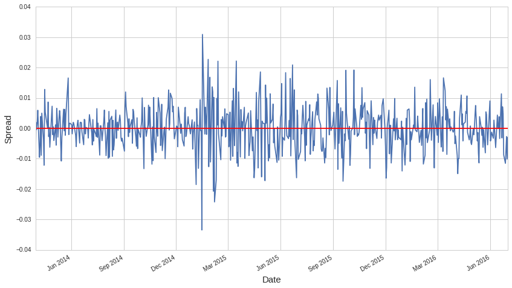
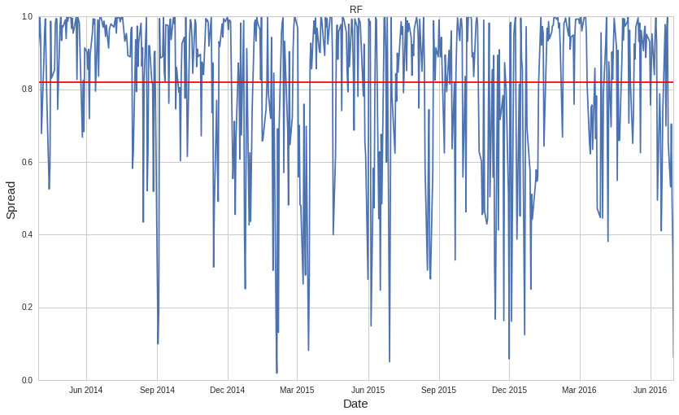

###### <h2 align="center">Nonparametric Pairs Trading with International ETFs</h2> 

**要旨**

Chan(2013)に示されているペア・トレーディング(ここでは２つの銘柄のペアのみを扱う)のアルゴリズムの結果をより安定させるため幾つかのノンパラメトリックな手法を導入した新しいアルゴリズムを構築した。その結果、共和分の関係がより強く、回帰において説明変数となる銘柄のヴォラティリティが被説明変数のそれより低いという条件がみたされている場合、より安定的に高いシャープ比率を挙げることができるアルゴリズムが作られたことを全23個のInternational ETFから作られた複数のペアで確認した。

使用銘柄(Schizas(2011)のそれに準拠)：MSCI Australia (EWA), MSCI Belgium (EWK), MSCI Austria (EWO),MSCI Canada (EWC), MSCI France (EWQ), MSCI Germany (EWG), MSCI Hong Kong (EWH), MSCI Italy (EWI), MSCI Japan (EWJ), MSCI Malaysia (EWM), MSCI Mexico (EWW), MSCI Netherlands (EWN), MSCI Singapore (EWS), MSCI Spain (EWP), MSCI Sweden (EWD), MSCI Switzerland (EWL), MSCI Japan (EWJ), MSCI S.Korea (EWY), MSCI EMU4 (EZU), MSCI UK(EWU), MSCI BRAZIL (EWZ), MSCI TAIWAN (EWT) and S&P500 (SPY)

I. Chan(2013)のアルゴリズム

大まかに

Step1:　ペアの選定
Step2:スプレッドの構築
Step3:スプレッドの平均回帰の検知

という3段階にわけられる。

・Step1

ペアが満たすべき幾つかの条件がある。

1. 銘柄の取引量の多さ：
ペア・トレーディングはショート・ロング注文が瞬時に約定されることが前提となっているため取引量が少ない銘柄では約定リスクがある

2. 相関の高さ：
ペア・トレーディングは似通った銘柄で回帰モデルを作って行われるため相関が低いとモデルリスクがある

3. 共和分の関係の強さ：
共和分が強いペアでないとスプレッド(=残差)が定常にならないため平均回帰の検知が難しい

これらの条件を満たしているかどうかを過去の銘柄のデータで確認し、満たしているペアのみで取引が行われる。

・Step 2

Step1の条件をみたしているだけでペア・トレーディングが上手くいくわけではない。そこからどのようなスプレッドを作るかにも幾つか考慮するべき点がある。

1. 銘柄の組み合わせ方：
スプレッドを構築するために回帰が行われるが(残差がスプレッドとなる)、どちらを説明変数とするかでスプレッドの定常性に差が生じる

2. パラメータの設定：
回帰に使うデータの量(何日前まで遡るか)であるルックバック期間をどのくらいの長さを取るかで結果が変わる

これらを決めるために過去のデータが使われる

・Step 3

最後にスプレッドの長期的な平均水準(残差なので0となる)から現在のスプレッドの値が乖離したか否かを判断するためにボリンジャー・バンドという手法が使われ、これもパラメータの設定がある。

パラメータの設定：
ボリンジャー・バンドは一定期間(パラメータを更に増やさないためにルックバック期間と等しくしてある)のスプレッドの値が正規分布に従うと仮定し、そのZ値がある閾値を越えたらポジションの開閉の判断を行う。この閾値がパラメータである。

・具体例


まず相関係数の高いペアを選ぶ。ここではEWG(ドイツの株式指数を追うETF)とEWL(スイスの株式指数を追うETF)を調べてみる。ここでは簡略化のために取引期間のデータでStep1,2を行う。


```python
#EWGとEWLの期間内のデータを入手
import numpy as np
EWG = get_pricing('EWG',fields='close_price',start_date='2014-01-01',
                end_date='2016-07-01',frequency='daily')
EWL = get_pricing('EWL',fields='close_price',start_date='2014-01-01',
                end_date='2016-07-01',frequency='daily')
#EWGとEWLの相関係数を計算
EWG.corr(EWL)
```


    0.84070199749938601


相関係数0.8以下だと実務的には切り捨てられるケースが多い。これはそれ以上なので条件を満たす。

さらに一日の平均取引量を調べる


```python
#EWGとEWLの期間内のデータを入手
EWG_v = get_pricing('EWG',fields='volume',start_date='2014-01-01',
                end_date='2016-07-01',frequency='daily')
EWL_v = get_pricing('EWL',fields='volume',start_date='2014-01-01',
                end_date='2016-07-01',frequency='daily')
#EWGとEWLの相関係数を計算
print([np.mean(EWG_v),np.mean(EWL_v)])
```

    [4738027.087301588, 666855.3031746031]


どちらも500000以上なので取引量も充分多いとみなせ、約定コストは低い。

次にStep2に移る。どちらを説明変数にするかには２つの方法がある。

1. 共和分の検定(CADF検定)のP値がより小さい説明変数・被説明変数の組み合わせ(Chan(2013)の方法)

2. ヴォラティリティがより小さい銘柄を説明変数とする組み合わせ(Vidyamurthy(2004)の方法)


```python
from statsmodels.tsa.stattools import coint
#EWGを被説明変数,EWLを説明変数として回帰してその結果生じたサヤをADF検定(ドリフトなし、定数項あり)で検定してp値を出す
a=coint(EWG,EWL,regression='c')[1]
#EWLを被説明変数,EWGを説明変数として回帰してその結果生じたサヤをADF検定(ドリフトなし、定数項あり)で検定してp値を出す
b=coint(EWL,EWG,regression='c')[1]
print([a,b])
X = np.log(EWG/EWG.shift(1))
Y = np.log(EWL/EWL.shift(1))
a = np.var(X)
b = np.var(Y)
#EWGとEWLのヴォラティリティを比較(小さいほうが説明変数となる)
print([a,b])
```

    [0.094138024301577028, 0.048426093381775358]
    [0.00016079014719640978, 8.723746080845282e-05]


ここでは2を採用してEWLを説明変数とする。

またルックバック期間を求めるために平均回帰の半減期という概念を導入する。それは以下のようにして求められる。


```python
import statsmodels.api as sm
#残差を作る
model = sm.OLS(EWG,sm.add_constant(EWL))
model_fit = model.fit()
resid =EWG-model_fit.predict(sm.add_constant(EWL))#残差
#残差の差分を一期前の残差の値で回帰してλを推定
md = sm.OLS(resid.diff(), sm.add_constant(resid.shift()), missing='drop')  
mdf = md.fit()
lambda_ = mdf.params[1]
#半減期　-log(2)/λを計算
half_life = -np.log(2)/lambda_
print(half_life)
```

    29.3435335085


半減期の二倍ほどの60日を目安としてルックバック期間を設定し、スプレッドを構築すると以下のようになる。


```python
import pandas as pd
import matplotlib.pyplot as plt
#X: EWGのlogリターン、EWLのlogリターン
model_ = pd.ols(y=X,x=Y,window_type='rolling',window=60)
model_.resid.plot()
plt.axhline(model_.resid.mean(),color='red')
plt.ylabel("Spread",fontsize=15)
plt.xlabel("Date", fontsize=15)
```


    <matplotlib.text.Text at 0x7f048cdaad50>





最後にStep3のボリンジャー・バンドを使用し、閾値を1.0としてやった取引結果が以下のようになる。

<a href="http://imgur.com/olkOcky"></a>

II. Chan(2013)のアルゴリズムの問題点

実際には取引期間(2014/01/01-2016/07/01)より前のデータでStep1,2は行わざるを得ず、その結果は参考にならないことが多々ある。


```python
EWG_old = get_pricing('EWG',fields='close_price',start_date='2013-01-01',
                end_date='2014-01-01',frequency='daily')
EWL_old = get_pricing('EWL',fields='close_price',start_date='2013-01-01',
                end_date='2014-01-01',frequency='daily')
EWG_old.corr(EWL_old)
```


    0.92426106525460261


```python
a=coint(EWG_old,EWL_old,regression='c')[1]
b=coint(EWL_old,EWG_old,regression='c')[1]
print([a,b])
X_old = np.log(EWG_old/EWG_old.shift(1))
Y_old= np.log(EWL_old/EWL_old.shift(1))
a = np.var(X_old)
b = np.var(Y_old)
print([a,b])
```

    [0.3275185901699697, 0.056772407198292775]
    [9.761570776249295e-05, 6.798166220694368e-05]


```python
model = sm.OLS(EWG_old,sm.add_constant(EWL_old))
model_fit = model.fit()
resid =EWG_old-model_fit.predict(sm.add_constant(EWL_old))
md = sm.OLS(resid.diff(), sm.add_constant(resid.shift()), missing='drop')  
mdf = md.fit()
lambda_ = mdf.params[1]
half_life = -np.log(2)/lambda_
print(half_life)
```

    20.3878889093


これらの結果よりYがEWL,XがEWG(前の逆)でルックバック40日で閾値は特に目安がないのでそのままにすると以下のような結果になる。

<a href="http://imgur.com/PKrS5jE"></a>

よって、このアルゴリズムはかなり運任せの要素が強く、安定性に欠けると判断せざるを得ない。

II.　ノンパラメトリックアルゴリズム

Chanのアルゴリズムが安定性に欠ける理由として線形回帰やZ値の計算などパラメトリックな手法が使われている点が考えられる。パラメトリックな手法はパラメータの設定が外れていた場合、往々にして信頼性に欠ける予測をしてしまうことが多い。

そこでこれらをいくつかのノンパラメトリックな手法で代替することでパラメータへの依存性を減らすことが可能かもしれない。

・使用するノンパラメトリックな手法の紹介

1. ブートストラップ法:
ブートストラップ法はリサンプリング(※)を使うことで推定量の母集団分布を近似できる手法である。この手法で予め分布や様々なパラメータがわからない推定量からも簡単に信頼性のある分散が得られる(標本がIIDの仮定がある)。

2. Random Forest回帰:
Random Forest回帰(以下RFと省略する)は回帰木(ステップファンクションを標本に当てはめる感じの回帰法)を各ブートストラップサンプル(上の(1,1,2,3,3)等)に当てはめ、最後にそれらの回帰予測の平均を最終的な回帰予測とする手法である。

※リサンプリング：重複ありのサンプリングを何度も繰り返すこと。例えば1-5までの数を(1,1,2,3,3),(2,2,2,2,5),(1,2,3,5,5),....と5個セットを何度もサンプリングする。

回帰木は単体だと局所最適性(局所的な標本の値に対応する力)はあるものの予測に頑健性がないが、各ブートストラップサンプルに回帰木を当てはめて最後に平均化することで局所に対応しすぎた部分の影響を削ぎ落として、頑健性が維持される範囲内で局所最適性を追求することができる。その為頑健性を犠牲にしないで、線形回帰よりも柔軟な予測を行うことができる。例えば、短期的なトレンドなどにRFで簡単に対応することが可能である。

・実際のプロセス

ノンパラメトリックアルゴリズムではChan(2013)のStep2,3を以下のように変更した

Step2: 線形回帰→RF

Step3:ボリンジャー・バンド→Stationary Bootstrap(時系列版のブートストラップ法)+スプレッドの加工(もとがxとするとexp(-x^2)に)

またRFを使うことで**logリターンではなく価格そのもので回帰をすることが可能となった**。前述のようにRFは短期的なトレンドに対応できるためわざわざトレンドを除去し情報量を制限したlogリターンを使うのではなく、生の価格をそのまま使っても相関の高さが維持される限り残差が平均回帰するからである。

例)EWQの値段でEWUのそれを予測したグラフ(上からルックバック200,100,44日、左が線形回帰、右がRF)

<tr>
    <td> <a href="http://imgur.com/6wpRPRR"></a>
    <td> <a href="http://imgur.com/wl2Rmxt"></a>
    </tr>

一番上のルックバック200日の左は過去のデータに引っ張られて全く予測が出来てないのに対して、RFはしばらくすると対応し始め、残差が0に戻る。ここからもRFの柔軟性の高さが現れており、ルックバック期間を大きく外してもスプレッドの平均回帰性には影響が少ないことがわかる。

・ノンパラメトリックアルゴリズムの具体例

銘柄の選択やルッバック期間はさっきのそれと同じEWG/EWL、60日で行う。


```python
from sklearn.ensemble import RandomForestRegressor
result = []
idx = 0
window = 60
oob =[]
while idx<(len(EWG)-window):
    rf = RandomForestRegressor(n_estimators=100,oob_score=True)
    rf.fit(EWL[idx:idx+window,None],EWG[idx:idx+window])
    result.append(rf.predict(EWL[idx+window]))
    oob.append(rf.oob_score_)
    idx = idx+1
resid_rf=[]
for idx,val in enumerate(result):
    resid_rf.append(float(EWG[idx+window]-val))
plt.plot(EWG[window:].index,np.exp(-np.array(resid_rf)**2))
plt.axhline(np.mean(np.exp(-np.array(resid_rf)**2)),color='red')
plt.title("RF")
plt.ylabel("Spread",fontsize=15)
plt.xlabel("Date", fontsize=15)
```


    <matplotlib.text.Text at 0x7f94f70aff10>





<a href="http://imgur.com/3I5igZH"></a>

過去のデータでパラメータを決めたケースだと(Y:EWL,X:EWG,ルックバック40日)以下のような結果となる

<a href="http://imgur.com/9AcHcNL"></a>

すくなくともこのペアではノンパラメトリックアルゴリズムの方が結果が安定している。

III. 様々な銘柄のペアでのテスト

実際にノンパラメトリックアルゴリズムのほうがChan(2013)のそれより安定しているのかどうかを全23個の銘柄からStep1が適切に成されたと仮定し、複数のペアを作って両者の結果を比較する。


```python
EUR_ETF =['EWA','EWK','EWO','EWC','EWQ','EWG','EWH','EWI','EWJ','EWM','EWW','EWN','EWS','EWP','EWD','EWL','EWJ',
         'EWY','EZU','EWU','EWZ','EWT','SPY']
coints = []
candidate = []
for idx,val in enumerate(EUR_ETF):
    Y_vol = np.mean(get_pricing(val,fields='volume',start_date='2014-01-01',
                                end_date='2016-07-01',frequency='daily'))
    if Y_vol>500000:
        for i,v in enumerate(EUR_ETF[:idx]+EUR_ETF[(idx+1):]):
            X_vol = np.mean(get_pricing(v,fields='volume',start_date='2014-01-01',
                                        end_date='2016-07-01',frequency='daily'))
            if X_vol>500000:
                Y = get_pricing(val,fields='close_price',start_date='2014-01-01',
                                end_date='2016-07-01',frequency='daily')
                X = get_pricing(v,fields='close_price',start_date='2014-01-01',
                                end_date='2016-07-01',frequency='daily')
                df = pd.concat([Y,X],axis=1)
                df = df.dropna()
                Y = df.iloc[:,0]
                X = df.iloc[:,1]
                a=coint(Y,X,regression='c')[1]
        #b=coint(X,Y,regression='c')[1]
                c = np.corrcoef(X,Y)[0][1]
                Y = np.log(Y/Y.shift(1))
                X = np.log(X/X.shift(1))
                X = X.dropna()
                Y = Y.dropna()
                hoge=np.std(Y)>np.std(X)
                if a<0.1 and c>0.9 and Y_vol>500000 and X_vol>500000:
                    candidate = np.append(candidate,[a,c,val,v,hoge])  
```


```python
dt=pd.DataFrame(np.array(candidate).reshape((len(candidate)/5,5)),
               columns = ['coint','cor','Y','X','X_std_smaller'])
dt.cor = dt.cor.astype(float)
dt.coint = dt.coint.astype(float)
print(dt)
```

この全24ペアをルックバック期間100,200,300日、閾値を0.75,1.0,1.5(Chanのケース),90%,95%,99%(ノンパラメトリックアルゴリズムのケース)でそれぞれ取引をしてみる。

そこから得られた全216個のシャープ比率のデータとChanのルールが満たされているかどうか(変数名：coint_smaller)、Vidyamurthyのルールが満たされているかどうか(変数名：X_std_smaller)で2変数分散分析を行った。以下がそのChanのアルゴリズムでの結果である。

<a href="http://imgur.com/mNjyn7y"></a>

それぞれの因子(coint_smallerとX_std_smaller)の主効果は有意だが交互作用は無く、それぞれの要因が独自にシャープ比率に影響を及ぼしていることが読み取れる。

<a href="http://imgur.com/CqnBlVm"></a>

上図がそれぞれのカテゴリ別のシャープ比率の平均値である(x軸が連続になってるがクラスが2つなので問題ない)。

次にノンパラメトリックアルゴリズムでの結果で同様の分析を行う

<a href="http://imgur.com/prGmTsK"></a>

このケースだと交互作用が有意となっている。

<a href="http://imgur.com/BIUTgtC"></a>

上図を見ると明白なようにVidyamurthyのルールが満たされているペアでChanのルールも満たしている場合のシャープ比率の平均が極めて高く、ノンパラメトリックアルゴリズムはこの要素を持つペアを取引すると安定的に高収益が上げられると考えられる。

共和分の関係はある程度長期的に続くため、至近の過去のデータのペア内の共和分の強弱はしばらくは維持されると考えられ、ヴォラティリティに関しては一部のペアではどちらがより高いかを推測することが可能なケースもある(例えば先進国と発展途上国の株式指数のETFをペアにできるならおそらく発展途上国のそれの方がヴォラティリティは高いだろう)。

よってこのような予測が可能な局面ではノンパラメトリックアルゴリズムはChanのそれより安定的に利益を挙げることが可能となるだろうということが一部のInternational ETFを使ったシミュレーションで確認された。
